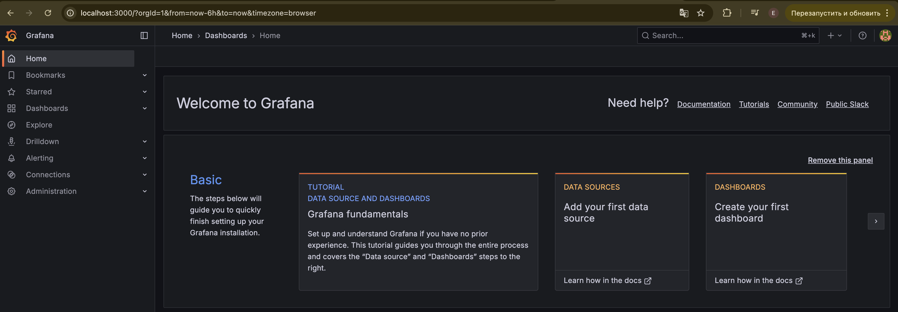
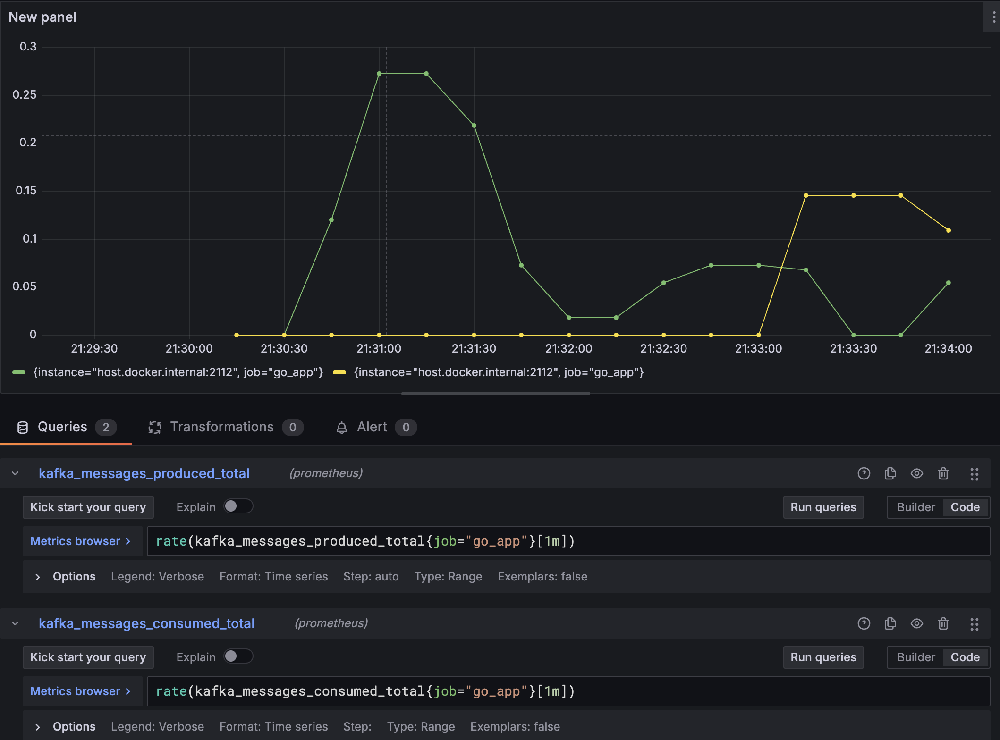

# go-kafka-playground

Учебный HTTP-сервер на Go, разработанный с фокусом на **чистоту архитектуры**, **безопасную обработку запросов** и **расширяемость**.  
Реализована интеграция с Kafka, метрики Prometheus и визуализация через Grafana.

⚠️ **Проект создан в учебных целях**. Цель — не production-ready сервер, а понимание устройства серверной части Go-приложений, обработки Kafka-сообщений и базового мониторинга.

---

## 📦 Используемые технологии

- **Go** — реализация HTTP-сервера (https://github.com/TGDevHub/go-mini-server), продюсера и консьюмера Kafka
- **Apache Kafka** — брокер сообщений
- **Prometheus** — сбор и хранение метрик
- **Grafana** — визуализация метрик
- **Docker Compose** — управление инфраструктурой

---

## 🚀 Быстрый старт

1. Склонируйте репозиторий:
```bash
git clone https://github.com/yourusername/go-kafka-playground.git
cd go-kafka-playground
```

2. Запустите все контейнеры (Kafka, Prometheus, Grafana):
```bash
docker compose -f kafka-docker/docker-compose.yml up
```

3. Запустите все контейнеры (Kafka, Prometheus, Grafana):
```bash
go run ./cmd/server/main.go
```
p.s. только нужно еще передать config.yaml 

4. Проверьте работу:
- HTTP сервер: http://localhost:8080
- Метрики Prometheus: http://localhost:2112/metrics
- Prometheus UI: http://localhost:9090
- Grafana: http://localhost:3000 (логин/пароль: admin / admin)

## 📊 Мониторинг и метрики

Метрики собираются с помощью Prometheus, а визуализируются через Grafana.

Пример отслеживаемых метрик:
- Количество Kafka-сообщений (отправленных и обработанных)
- Количество HTTP-запросов
- Время ответа сервера

Пример графика из Grafana:



## 🧩 Архитектура
```
go-mini-server/
├── cmd/server/           # Точка входа
├── internal/kafka/       # Продюсер и консьюмер Kafka
├── internal/web/         # HTTP-обработчик
├── internal/metrics/     # Prometheus-метрики
├── kafka-docker/         # Docker Compose + конфиги Kafka, Prometheus, Grafana
└── go.mod / go.sum       # Зависимости
```
